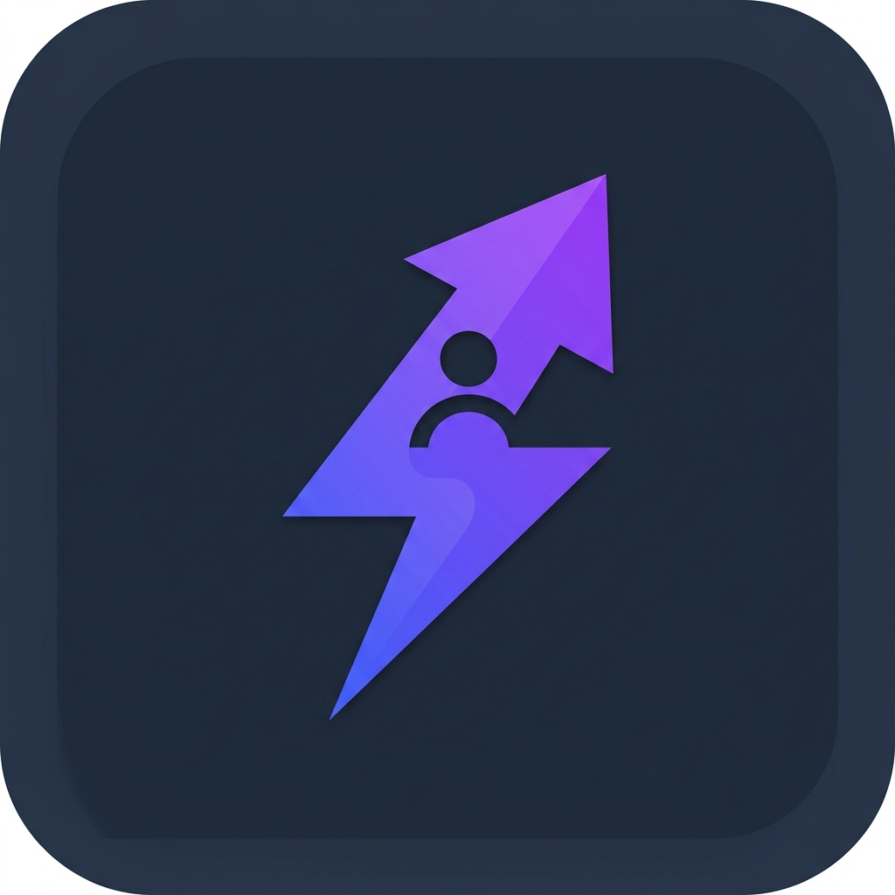
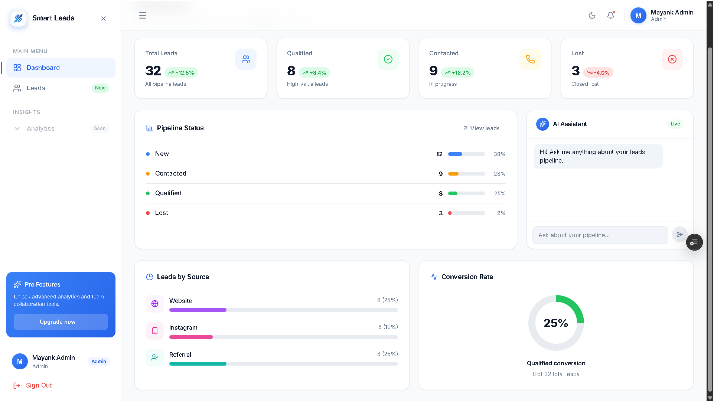
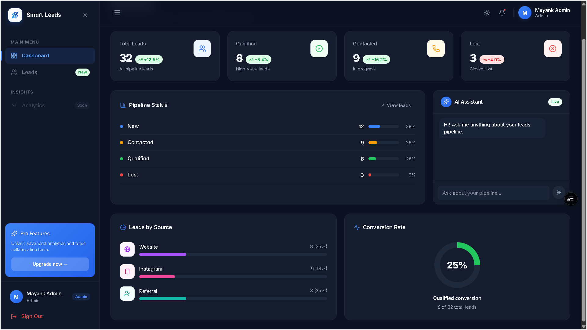
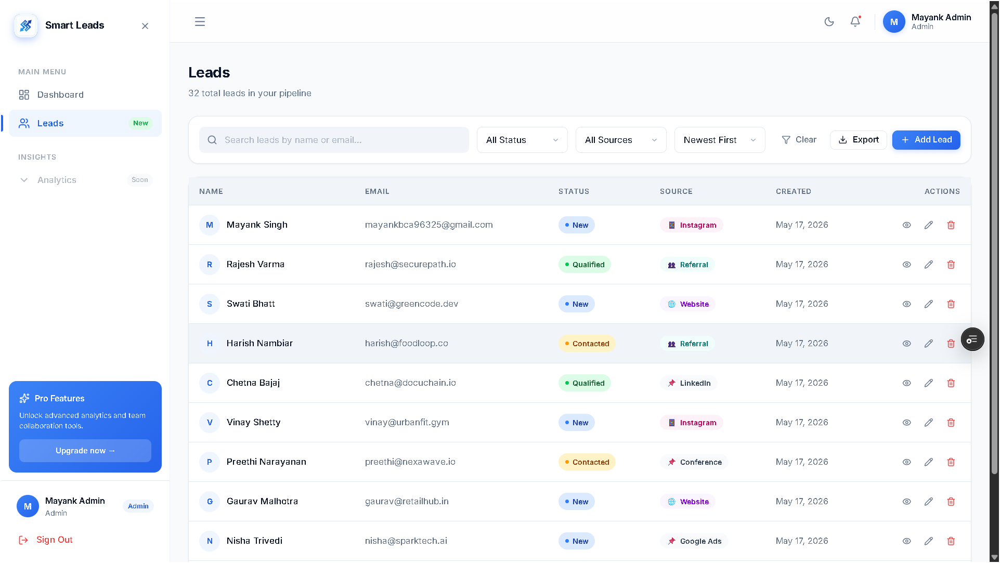
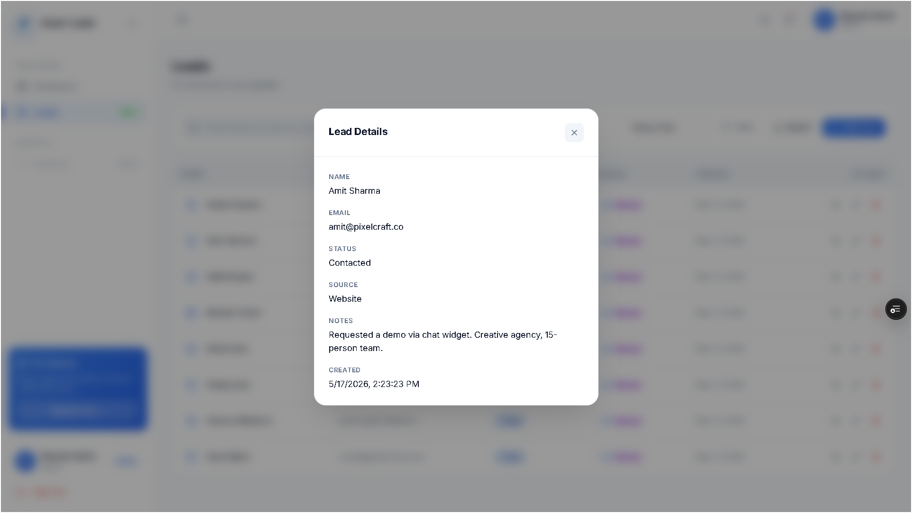
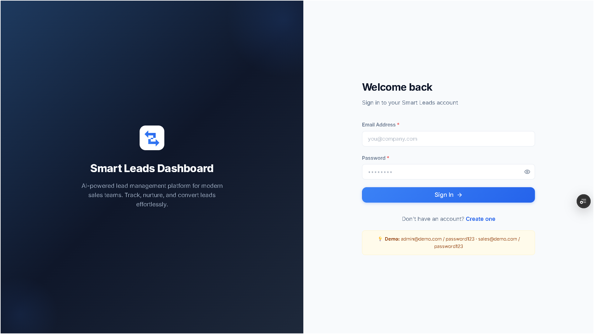

<p align="center">
  # GigFlow - Smart Lead Dashboard
</p>

<p align="center">
  
</p>

<p align="center">
  <strong>AI-Powered Lead Management CRM — Built with the MERN Stack</strong><br/>
  Track, nurture, and convert leads with a beautiful analytics dashboard and a live AI assistant.
</p>

<p align="center">
  
  
  
  
  
</p>

---

## ✨ Features

- **Full CRUD** — Create, read, update, and delete leads with instant feedback
- **Role-based access** — Admin and Sales roles with separate permissions
- **Live AI Assistant** — Powered by Groq's LLaMA 3.3 70B, with your pipeline context injected automatically
- **Analytics Dashboard** — Stat cards with trend badges, pipeline status bars, source breakdown, and conversion rate donut chart
- **Authentication** — JWT-based auth with protected routes and persistent sessions
- **CSV Export** — Export your entire lead list with one click
- **Responsive** — Mobile-first layout with collapsible sidebar
- **Dark Mode** — System-aware with manual toggle
- **Shopeers-inspired UI** — Clean glassmorphic design with micro-animations

## 📸 Screenshots

*(Note: Add your attached screenshots to an `assets/` folder in the repo to display them here)*

### Dashboard (Light & Dark Mode)



### Leads Management & Details



### Authentication


## 🌐 Live Demo

You can view the live application here: **[Smart Lead Dashboard Live Demo](https://smart-lead-dashboard-mayank.vercel.app/)**

## ⚡ Performance & Lighthouse Scores

This application was engineered with web performance as a primary directive, targeting **90+ Lighthouse scores** across all metrics. Key optimizations include:
- **Code Splitting:** React routes and component libraries are dynamically chunked via `React.lazy` and `Suspense`.
- **API Caching:** A custom in-memory cache intercepts redundant API calls within a 5-minute TTL, invalidating instantly upon data mutations (Create, Update, Delete).
- **Memoization:** Expensive renders (like the Leads data table) are wrapped in `React.memo` to ensure UI stability during independent state changes.
- **Debouncing:** Rapid state updates (like search queries) are debounced by 400ms to prevent API thrashing.
- **Image & Asset Lazy Loading:** Non-critical visual assets are deferred using `loading="lazy"`.

## 🧠 Challenges Faced

- **Complex State Management:** Orchestrating modal visibility, global authentication, and API caching required a robust `Zustand` architecture paired with custom React hooks (`useLeads`).
- **Production Build Stability:** Strict TypeScript constraints (like `verbatimModuleSyntax` and orphaned UI components) initially blocked CI/CD pipelines, requiring deep refactoring of module resolution patterns.
- **AI Context Integration:** Securely injecting real-time MongoDB pipeline statistics into the Groq LLaMA prompt without exposing raw data or slowing down the UI required careful backend orchestration.

## 🔮 Future Improvements

- **Scalability & Cloud Infrastructure:** Move from PaaS (Render/Vercel) to a dedicated cloud architecture (AWS/GCP), attach a custom domain, and implement a load balancer for high availability.
- **Advanced Caching & Rate Limiting:** Implement server-side caching (e.g., Redis) in tandem with the existing client-side cache, and add strict API rate limiting to protect endpoints from abuse.
- **Drag-and-Drop Kanban Board:** Convert the tabular leads view into an interactive Trello-style pipeline.
- **Email Integration:** Connect providers like Resend to dispatch automated follow-ups directly from the dashboard.
- **Advanced Role Permissions:** Granular permissions allowing Sales users to only view leads explicitly assigned to them.
- **Webhooks:** Automated lead ingestion from external sources like Typeform, Facebook Ads, or custom landing pages.

## 💻 Local Setup

### Prerequisites
- Node.js 18+
- MongoDB Atlas account (or local MongoDB)
- Groq API key (free at [console.groq.com](https://console.groq.com))

### 1. Clone
```bash
git clone https://github.com/coderMayank69/Smart-Lead-Dashboard.git
cd Smart-Lead-Dashboard
```

### 2. Server setup
```bash
cd server
cp ../.env.example .env   # fill in your values
npm install
npm run dev               # starts on :5000
```

### 3. Client setup
```bash
cd client
# .env already has VITE_API_URL=http://localhost:5000/api/v1
npm install
npm run dev               # starts on :5173
```

### 4. Docker (full stack)
```bash
# From project root — needs MONGODB_URI + JWT_SECRET in .env
docker compose up --build
# Frontend: http://localhost
```

## 🔑 Environment Variables

### Server (`server/.env`)
| Variable | Required | Description |
|---|---|---|
| `MONGODB_URI` | ✅ | MongoDB Atlas connection string |
| `JWT_SECRET` | ✅ | Secret key for JWT signing |
| `JWT_EXPIRES_IN` | | Token expiry (default: `7d`) |
| `CLIENT_URL` | | Comma-separated allowed origins |
| `GROQ_API_KEY` | ✅ | Groq API key for AI assistant |
| `PORT` | | Server port (default: `5000`) |

### Client (`client/.env`)
| Variable | Description |
|---|---|
| `VITE_API_URL` | Backend API base URL |

## 🏗️ Architecture

```
Smart-Lead-Dashboard/
├── client/               # React + Vite + TypeScript
│   ├── src/
│   │   ├── api/          # Axios API clients
│   │   ├── components/   # UI + layout + lead components
│   │   ├── hooks/        # useLeads, useDebounce
│   │   ├── pages/        # Dashboard, Leads, Login, Register
│   │   ├── store/        # Zustand auth + UI stores
│   │   └── types/        # Shared TypeScript interfaces
│   └── public/           # Logo, favicon
└── server/               # Express + TypeScript
    └── src/
        ├── config/       # DB + env config
        ├── controllers/  # Auth + Lead + AI handlers
        ├── middlewares/  # Auth, validation, error handling
        ├── models/       # Mongoose User + Lead models
        ├── routes/       # Auth, Lead, AI routes
        └── validators/   # Zod schemas
```

## 🤖 AI Assistant

The AI assistant uses **Groq's LLaMA 3.3 70B** model. On each message it automatically injects your current pipeline stats as context so it can give specific, actionable insights:

> "You have 24 total leads. Website is your top source at 67%. Your qualified conversion rate is 29% — industry average is 20-25%, so you're performing well!"

## 🚢 Deployment

### Render & Vercel
1. Push to GitHub
2. Create **Web Service** on Render for `server/` → set all env vars → add `GROQ_API_KEY`
3. Create **Project** on Vercel for `client/` → set `VITE_API_URL` to your Render server URL

The CORS config automatically accepts `.onrender.com` and `.vercel.app` origins.

## 📄 Demo Credentials
| Role | Email | Password |
|---|---|---|
| Admin | admin@demo.com | password123 |
| Sales | sales@demo.com | password123 |

## 📝 License
MIT — Built by [Mayank Singh](https://mayank-developer.vercel.app)
